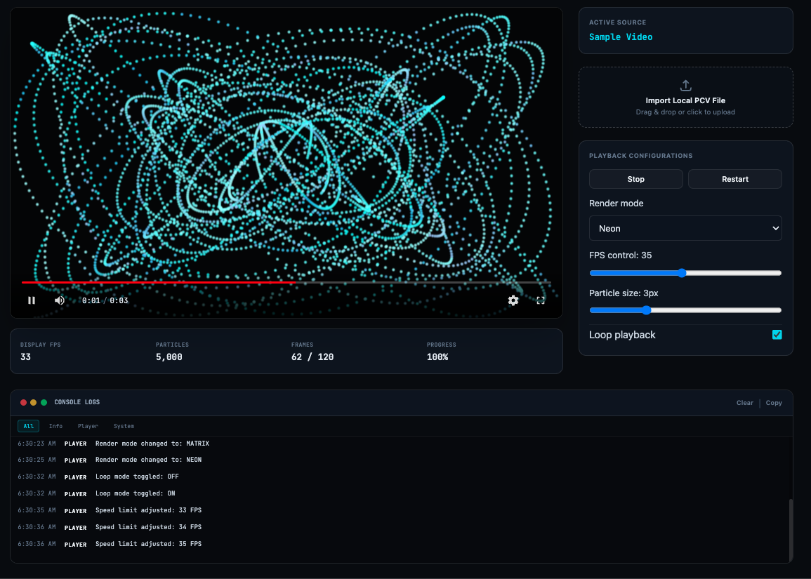
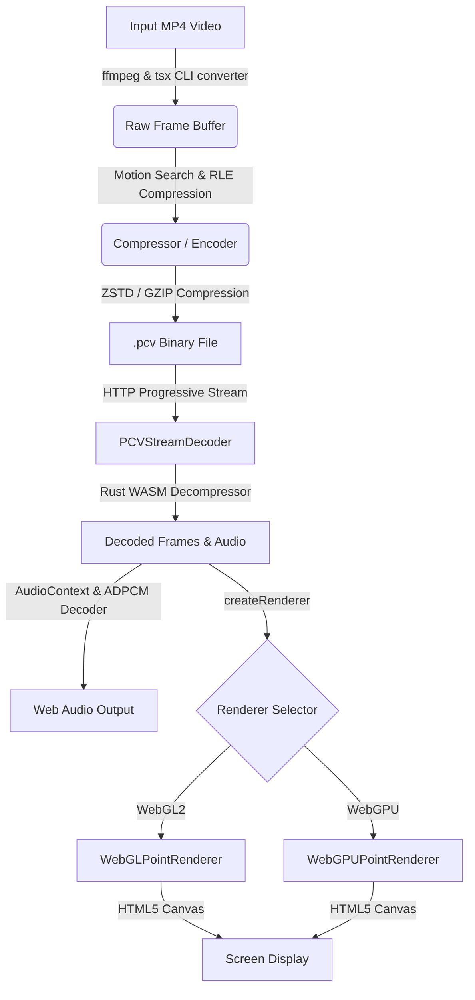

# 🌌 Point Cloud Video (PCV) Player & Platform

A complete proof-of-concept custom video platform that encodes ordinary videos into a custom particle-based binary format (`.pcv`) and streams/renders them entirely via GPU point primitives (**WebGL2** & **WebGPU**). No native video elements, no browser media codecs, and no MediaSource API are used for playback.



---

## ✨ Features

- **Custom Binary Video Format (`.pcv`)**: A highly optimized streamable binary format with a custom 32-byte header, delta-compressed frames, and embedded ADPCM audio blocks.
- **Progressive Streaming Decoder**: Uses `fetch` and `ReadableStream` to decode video chunks on the fly. Playback starts immediately without waiting for the entire file to download.
- **Dual GPU Rendering Backends**:
  - **WebGL2 Renderer** (`gl.POINTS`) featuring soft circular particles and a bloom/neon glow post-processing effect.
  - **WebGPU Renderer** using next-generation compute/render pipelines for maximum performance.
- **Advanced Frame Delta-Compression**:
  - Keyframes, RLE (Run-Length Encoding) keyframes, Delta updates, and XOR delta modes.
  - Motion-compensated delta updates using block-matching search algorithms.
  - Variable color-depth quantization (RGB565 16-bit or 12-bit color).
- **Embedded Audio Stream**: Compresses stereo audio at 48kHz using 4-bit IMA-ADPCM (~4x compression ratio) stored as a trailing block in the `.pcv` file, played back in perfect sync using the Web Audio API.
- **Multi-threaded Web Assembly**: A Rust-based ZSTD/RLE decompressor compiled to WASM (`wasm-encoder`) to offload heavy CPU decoding cycles.
- **Modern UI Suite**: A futuristic dark-mode dashboard with:
  - YouTube-style professional video player controls.
  - Advanced debug instrumentation showing real-time FPS, particle throughput, download speeds, and decoding latency logs.
  - Web-based video converter dashboard (drag-and-drop file conversion).
  - Runtime rendering filters: **Normal**, **Neon**, **Matrix**, and **Wireframe/Debug Overlay**.

---

## 🛠️ Architecture



---

## 📂 Project Structure

- [`shared/format.ts`](file:///Users/faistech/wwjs/canvasplayer/shared/format.ts): Definition of the `.pcv` binary layout, headers, flag structures, and basic encoding/decoding helper routines.
- [`converter/converter.ts`](file:///Users/faistech/wwjs/canvasplayer/converter/converter.ts): Node.js/TypeScript CLI video encoder that spawns FFmpeg to extract frames, run block-matching motion compensation, and write compressed `.pcv` files.
- [`wasm-encoder/`](file:///Users/faistech/wwjs/canvasplayer/wasm-encoder): Rust WASM codebase handling heavy computation during decompression/RLE parsing.
- [`src/decoder/PCVStreamDecoder.ts`](file:///Users/faistech/wwjs/canvasplayer/src/decoder/PCVStreamDecoder.ts): progressive chunk loader pulling stream data, performing decompression and decoding headers/frames.
- [`src/player/PointCloudPlayer.ts`](file:///Users/faistech/wwjs/canvasplayer/src/player/PointCloudPlayer.ts): High-level player controller managing playback state, speed, loops, frame tick loops, and synchronization between render ticks and audio.
- [`src/renderer/`](file:///Users/faistech/wwjs/canvasplayer/src/renderer): GPU renderer backends:
  - [`WebGLPointRenderer.ts`](file:///Users/faistech/wwjs/canvasplayer/src/renderer/WebGLPointRenderer.ts)
  - [`WebGPUPointRenderer.ts`](file:///Users/faistech/wwjs/canvasplayer/src/renderer/WebGPUPointRenderer.ts)
- [`src/ui/`](file:///Users/faistech/wwjs/canvasplayer/src/ui): React web client components including:
  - `App.tsx`: The main player shell interface.
  - `PlayerControls.tsx`: Timeline, playback state buttons, audio controls, and full-screen controls.
  - `ConverterPage.tsx`: Drag-and-drop web converter interface.

---

## 💾 PCV File Format Specifications

The `.pcv` format is a custom streamable binary format structured as follows:

### 1. File Header (32 bytes)
| Offset | Type | Description |
| :--- | :--- | :--- |
| `0` | `uint32` | Magic Number (`0x33564350` - `"PCV3"` little-endian) |
| `4` | `uint16` | PCV Version (current is `3`) |
| `6` | `uint16` | Header Size (always `32`) |
| `8` | `uint32` | Canvas Width |
| `12` | `uint32` | Canvas Height |
| `16` | `float32`| Playback Frame Rate (FPS) |
| `20` | `uint32` | Total Frame Count |
| `24` | `uint32` | Base Particle Count per frame (width * height) |
| `28` | `uint32` | Flag bits (ZSTD-compressed, has Audio, delta-compression types) |

### 2. Video Frames
Consecutive chunks containing:
- **`uint32`**: Number of samples/particles updated in this frame.
- **Payload**: High density, RLE, or delta-coded color updates representing screen motion.

### 3. Trailing Audio Block (Optional)
If the flag bit indicates audio, a trailing audio block with magic `0x41564350` (`"PCVA"`) contains:
- Channels count (Stereo)
- Sample Rate (48000 Hz)
- Adaptive Delta PCM (4-bit IMA-ADPCM) block layout for low-footprint high-fidelity audio sync.

---

## 🚀 Getting Started

### Prerequisites
- [Node.js](https://nodejs.org/) (v18 or higher recommended)
- [FFmpeg](https://ffmpeg.org/) (installed and added to your system path for command line conversions)
- *Optional*: [zstd](https://facebook.github.io/zstd/) (CLI utility for high-level compression; the converter automatically falls back to GZIP if `zstd` is missing)

### Installation
Clone the repository and install the dependencies:
```bash
npm install
```

### CLI Conversion
Convert any MP4 file to PCV format using the converter CLI:
```bash
npm run convert -- input.mp4 output.pcv [options]
```

#### Converter Options
- `--quality [auto | 160p | 320p | 720p | 1080p | custom]`: Video rendering height (default: `auto`).
- `--size [WIDTH]x[HEIGHT]`: Specify a custom resolution (e.g. `--size 160x90`).
- `--size-mode [small | balanced | best]`: Compression quality mode. `best` yields the smallest file size at the cost of higher CPU compression time.
- `--fps [number]`: Target framerate (default: `15`).
- `--audio` / `--no-audio`: Include or exclude audio (default: `--no-audio`).
- `--gpu`: Enable hardware acceleration for FFmpeg parsing (automatically selects Apple Videotoolbox on macOS).
- `--max-frames [number]`: Stop converting after processing a maximum number of frames.

*Example:*
```bash
npm run convert -- movie.mp4 public/movie.pcv --quality 320p --size-mode balanced --fps 24 --audio --gpu
```

### Running the Web Application
Start the Vite development server to test the player interface:
```bash
npm run dev
```
Open [http://localhost:5173](http://localhost:5173) in your browser to play `.pcv` files, configure rendering pipelines, toggle shaders, and view the diagnostic logger.
